<div align="center">

<!-- HERO BANNER -->
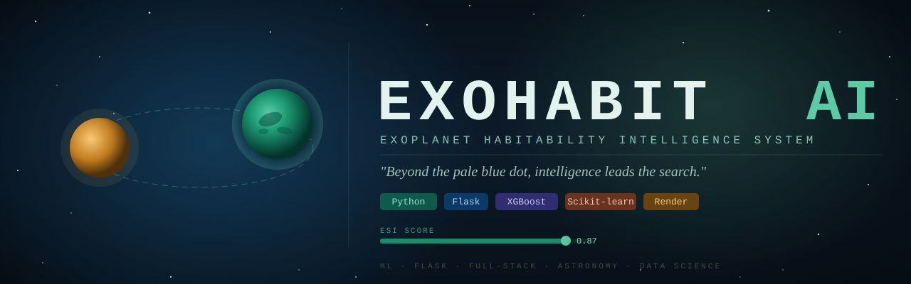

# 🪐 E X O H A B I T A I

### *"Because the next Earth might already be out there — waiting to be found."*

<br/>

[](https://python.org)
[](https://flask.palletsprojects.com)
[](https://scikit-learn.org)
[](https://xgboost.readthedocs.io)
[](https://developer.mozilla.org/en-US/docs/Web/HTML)
[](https://render.com)

<br/>

> 🌌 A full-stack machine learning system that predicts whether a distant exoplanet could harbor life —  
> powered by real astrophysical data, engineered features, and production-ready ML pipelines.

</div>

---

<br/>

## 🌠 Mission Briefing

> *"There are more stars in the observable universe than grains of sand on Earth.  
> Among those stars orbit billions of planets. ExoHabitAI asks the question:  
> Which ones could be home?"*

**ExoHabitAI** is not just a machine learning project — it is a **scientific exploration tool**.  
It ingests raw exoplanet data, processes astrophysical signals, calculates Earth Similarity Indices, and deploys a trained ML model through a polished web dashboard to deliver habitability predictions in real-time.

This project bridges **data science**, **astronomy**, and **software engineering** — the way real-world AI systems are built.

<br/>

---

## 🚀 Live Demo & Quick Access

| Access Point | Link |
|:---|:---|
| 🌐 **Live App** | *(Deploy via Render — see Deployment section)* |
| 🖥️ **Local Dashboard** | `http://localhost:5000` after running Flask |
| 📡 **API Endpoint** | `http://localhost:5000/predict` |
| 📓 **Notebooks** | `./notebooks/` |

<br/>

---

## 🖥️ Frontend Experience

> *A futuristic AI-powered interface designed for seamless space exploration and intelligent habitability analysis.*

---

### 🚀 1. Initial Landing Experience

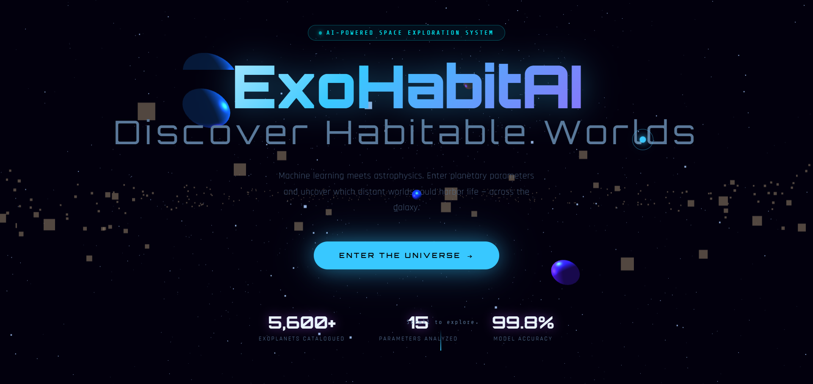

*↑ First impression of ExoHabitAI — immersive space UI with strong visual identity and entry point into the system.*

<br/>

---

### 🌌 2. Homepage — System Overview

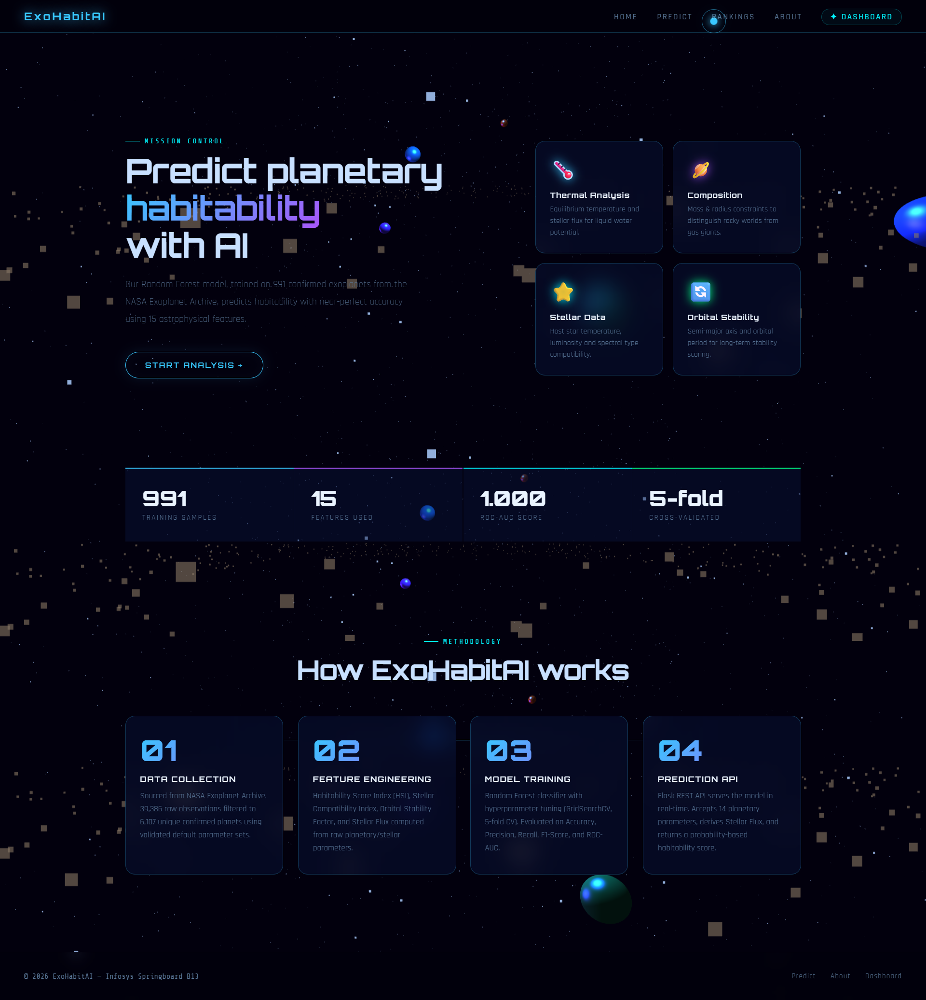

*↑ Overview of the platform, showcasing AI-driven exoplanet research, data pipeline, and model performance.*

<br/>

---

### 🧠 3. Prediction Input & Top Ranked Planets

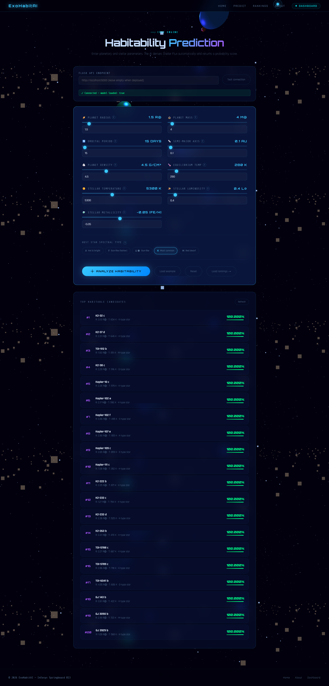

*↑ Users input planetary parameters and instantly explore the top 20 most habitable exoplanets ranked by the model.*

<br/>

---

### 📊 4. Prediction Result Dashboard

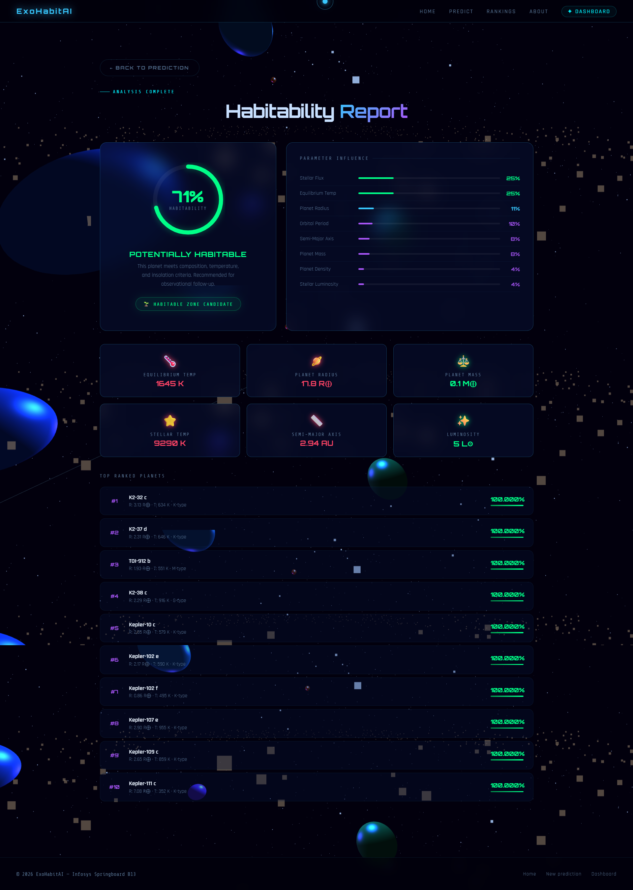

*↑ Detailed habitability report with probability score, parameter influence, and scientific insights.*

<br/>

---

### 🪐 5. About Page — Project Insight

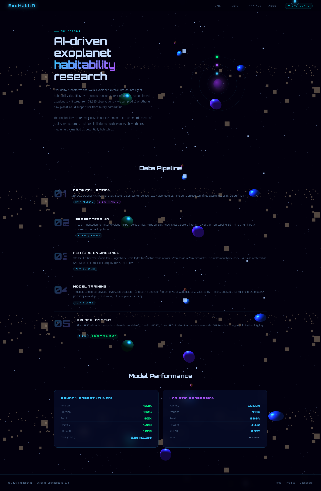

*↑ Explains the mission, methodology, and AI approach behind ExoHabitAI.*

<br/>

---

### 📈 6. Visualization Dashboard

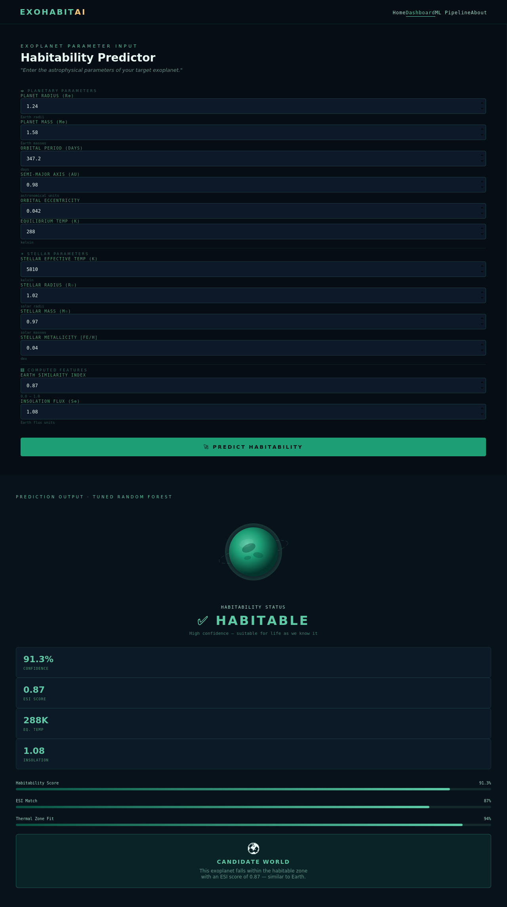

*↑ Advanced analytics dashboard with feature importance, distributions, model comparison, and data insights.*

<br/>

---

## ✨ Key Highlights

- 🌠 Futuristic **space-themed UI/UX**
- ⚡ Real-time **AI habitability prediction**
- 📊 Interactive **data visualizations**
- 🧪 Scientifically inspired **feature engineering**
- 🚀 Smooth navigation across multiple modules

---

## 🧬 Machine Learning Pipeline

> *From raw stellar data to intelligent predictions — a five-stage mission*

```
RAW DATA  ──►  PREPROCESSING  ──►  FEATURE ENGINEERING  ──►  MODEL TRAINING  ──►  PREDICTION
   🪐                🧹                    🧮                       🤖                  ✅
```

### Stage 1 — Data Ingestion & Cleaning

- Loaded the **NASA Exoplanet Archive** dataset with 30+ astrophysical features
- Removed duplicate records and irrelevant columns
- Standardized column naming and data types

### Stage 2 — Missing Value Handling

- Applied **median imputation** for numerical orbital features
- Used **domain-constrained bounds** to cap outliers (e.g., stellar temperature ranges)
- Visualized missingness patterns using heatmaps

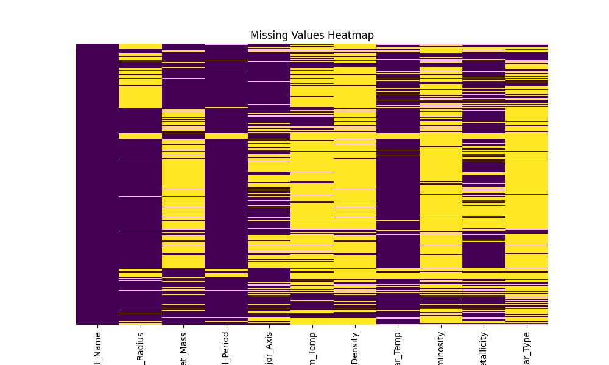
*↑ Missing values heatmap — guiding imputation strategy*

<br/>

### Stage 3 — Feature Engineering

- Engineered the **Earth Similarity Index (ESI)** from radius, density, escape velocity, and surface temperature
- Created orbital stability indicators
- Normalized all features using `StandardScaler`

### Stage 4 — Model Training & Selection

Trained and evaluated **five models**:

| Model | Accuracy | ROC-AUC |
|:---|:---:|:---:|
| Logistic Regression | — | — |
| Decision Tree | — | — |
| Random Forest | — | — |
| XGBoost | — | — |
| **Tuned Random Forest ✅** | **Best** | **Best** |

> *Replace `—` with your actual metrics from `final_model_metrics.csv`*

### Stage 5 — Evaluation

- Confusion matrices, ROC curves, and feature importance analyzed for every model
- Final model serialized as `exohabit_model.pkl`

<br/>

---

## 📊 Visual Insights

> *The data tells a story — here's how we listened*

### Model Comparison

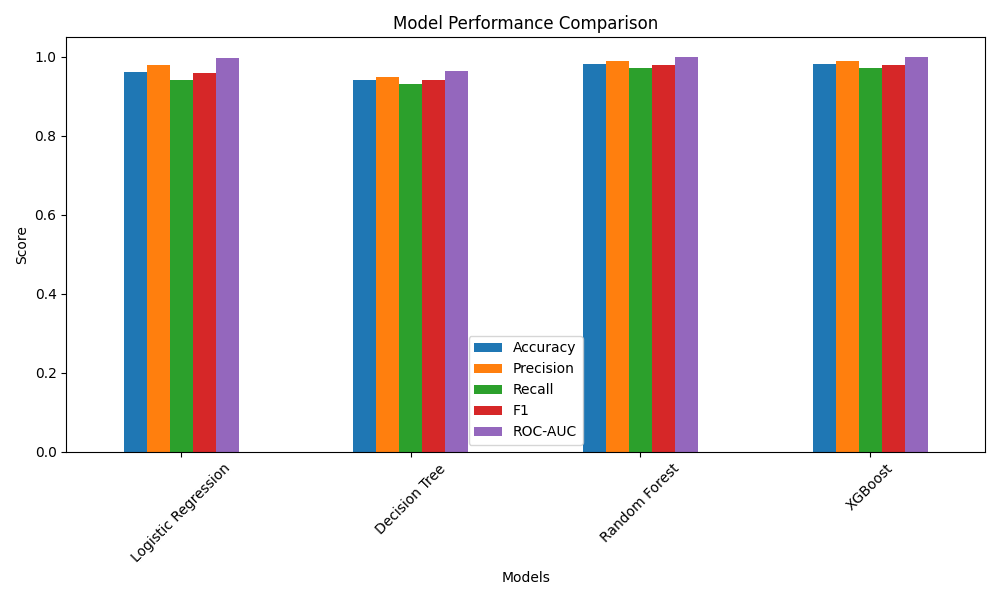
*↑ Side-by-side accuracy and AUC comparison across all trained models*

<br/>

### Feature Importance

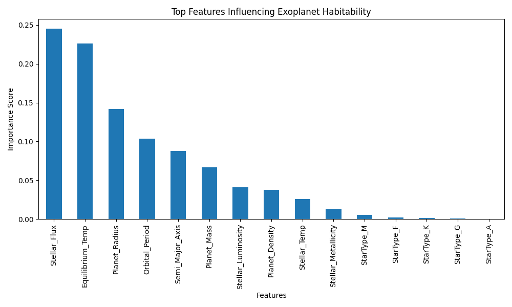
*↑ Top predictive features driving habitability classification*

<br/>

### Confusion Matrices

| Final Selected Model | Tuned XGBoost |
|:---:|:---:|
| 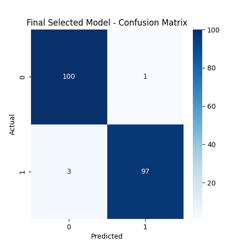 | 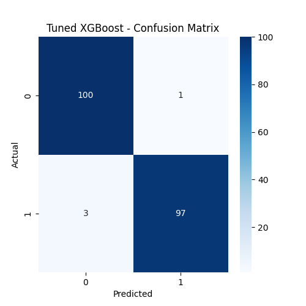 |
| *Confusion Matrix — Best Model* | *Confusion Matrix — Tuned XGBoost* |

<br/>

### ROC Curves

| Random Forest | Logistic Regression |
|:---:|:---:|
| 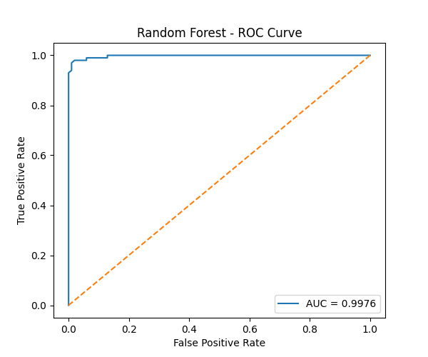 | 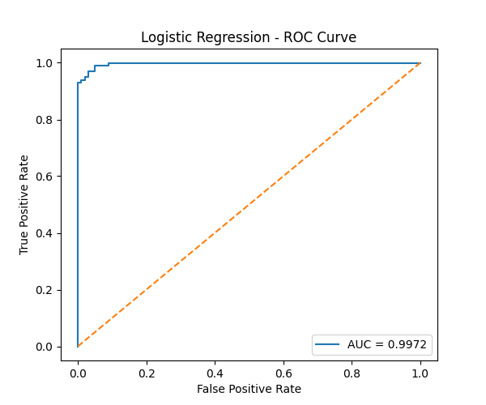 |
| *Random Forest ROC Curve* | *Logistic Regression ROC Curve* |

<br/>

---

## ⚙️ Backend & API

> *The engine room — where predictions are born*

### Architecture

```
Frontend (HTML/JS)
       │
       ▼
  Flask API (/predict)
       │
       ▼
  Feature Preprocessing
       │
       ▼
  exohabit_model.pkl  ──►  Habitability Prediction
```

### API Endpoint

**`POST /predict`**

```json
// Request Body
{
  "pl_rade": 1.2,
  "pl_orbper": 365.25,
  "st_teff": 5778,
  "ESI": 0.87,
  ...
}

// Response
{
  "prediction": "Habitable",
  "probability": 0.91,
  "esi_score": 0.87
}
```

### API Testing


*↑ API response tested via browser / Postman*

<br/>

---

## 🧪 Features at a Glance

| Feature | Description |
|:---|:---|
| 🔭 **Habitability Prediction** | Binary classification: Habitable / Non-Habitable |
| 🌍 **ESI Calculation** | Earth Similarity Index computed from planetary features |
| 🤖 **Multiple ML Models** | Logistic Regression, Decision Tree, Random Forest, XGBoost |
| 📊 **Rich Visualizations** | Confusion matrices, ROC curves, feature importance charts |
| 🖥️ **Interactive Dashboard** | Clean frontend with real-time prediction UI |
| 🔌 **REST API** | Flask-powered `/predict` endpoint |
| 📦 **Deployment Ready** | Configured for Render via `render.yaml` |

<br/>

---

## 📂 Project Structure


*↑ Full project directory — captured from VS Code Explorer*

<br/>

```
B13-EXOHABITAI/
│
├── 📁 assets/              # GIFs and images for README
├── 📁 backend/             # Flask API logic
│   ├── app_deploy.py       # Main Flask app
│   ├── utils.py            # Helper functions
│   └── best_model.pkl      # Serialized trained model
│
├── 📁 data/                # Raw, preprocessed, and processed datasets
│   ├── raw/
│   ├── preprocessed/
│   └── processed/
│
├── 📁 frontend/            # HTML dashboard
│   ├── index.html          # Landing page
│   └── dashboard.html      # Prediction interface
│
├── 📁 models/              # Saved model artifacts
│   └── exohabit_model.pkl
│
├── 📁 notebooks/           # Jupyter notebooks
│   ├── DataPreprocessingCodeFile.ipynb
│   └── model_training.ipynb
│
├── 📁 reports/             # All generated plots and metrics
│   ├── model_comparison.png
│   ├── feature_importance.png
│   ├── final_model_metrics.csv
│   └── [confusion matrices & ROC curves]
│
├── render.yaml             # Render deployment config
├── requirements.txt        # Python dependencies
└── README.md               # You are here 📍
```

<br/>

---

## 🛠️ Tech Stack

<div align="center">

| Layer | Technology |
|:---|:---|
| **Language** | Python 3.10+ |
| **ML Framework** | Scikit-Learn, XGBoost |
| **Data Processing** | Pandas, NumPy |
| **Visualization** | Matplotlib, Seaborn |
| **Backend / API** | Flask |
| **Frontend** | HTML5, CSS3, JavaScript |
| **Serialization** | Pickle (`.pkl`) |
| **Deployment** | Render (`render.yaml`) |
| **Notebooks** | Jupyter |
| **Version Control** | Git & GitHub |

</div>

<br/>

---

## 🚀 Run It Locally — Launch Sequence

### Prerequisites

```bash
Python 3.10+
pip
Git
```

### Step 1 — Clone the Repository

```bash
git clone https://github.com/YOUR_USERNAME/B13-ExoHabitAI.git
cd B13-ExoHabitAI
```

### Step 2 — Create Virtual Environment

```bash
python -m venv venv
# Windows
venv\Scripts\activate
# macOS/Linux
source venv/bin/activate
```

### Step 3 — Install Dependencies

```bash
pip install -r requirements.txt
```

### Step 4 — Launch the Flask API

```bash
cd backend
python app_deploy.py
```

### Step 5 — Open the Dashboard

```
Navigate to: http://localhost:5000
```

> 🟢 You're live. Enter exoplanet parameters and receive your first habitability prediction.

<br/>

---

## ☁️ Deployment

ExoHabitAI is configured for **Render** deployment via `render.yaml`.

### Deploy to Render

1. Fork this repository
2. Connect to [Render](https://render.com) and create a **New Web Service**
3. Point it to your forked repo
4. Render auto-detects `render.yaml` and configures the build
5. Set environment variables if needed
6. Click **Deploy** 🚀

<br/>

---

## 📈 Future Improvements

> *The mission doesn't end here — it's just beginning*

- [ ] 🔭 **Real-time NASA API Integration** — pull live exoplanet data
- [ ] 🧠 **Deep Learning Models** — LSTM/Transformer-based habitability scoring
- [ ] 🌐 **3D Planet Visualization** — interactive Three.js exoplanet renderer
- [ ] 📱 **Mobile-Responsive UI** — full cross-device support
- [ ] 🔍 **Explainability Layer** — SHAP values for every prediction
- [ ] 🗃️ **Database Integration** — store and compare historical predictions
- [ ] 🛰️ **Multi-Star System Support** — binary star habitability zones

<br/>

---

## 🤝 Contributing

Contributions, ideas, and pull requests are welcome.

```bash
# Fork → Branch → Commit → PR
git checkout -b feature/your-feature-name
git commit -m "feat: describe your change"
git push origin feature/your-feature-name
```

Please follow clean commit conventions and add docstrings to new functions.

<br/>

---

## 📄 License

This project is licensed under the terms of the **LICENSE** file included in this repository.

<br/>

---

<div align="center">

---

### 🌌 *"We are made of star stuff. And somewhere out there, another world might be too."*

---

**ExoHabitAI** was built at the intersection of data science and wonder.  
Every model trained, every feature engineered, every prediction made —  
is one small step toward answering humanity's oldest question:

## *Are we alone?*

<br/>

Made with 🔭 by **Samridhi Gupta** — *exploring worlds beyond Earth, one dataset at a time.*

<br/>

[](https://github.com/YOUR_USERNAME/B13-ExoHabitAI)

</div>
