<!-- ============================================================
     ExoHabitAI — README.md
     A Machine-Learning System for Exoplanet Habitability Ranking
     ============================================================ -->

<div align="center">

<!-- ░░░░░░░░░░░░░░░░░░░░  HERO BANNER  ░░░░░░░░░░░░░░░░░░░░ -->

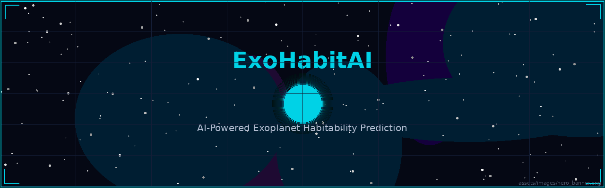
> 🖼️ *Suggested content: A cinematic deep-space panorama — nebula clouds, distant star clusters, an Earth-like exoplanet glowing blue-green against the void, with the text "ExoHabitAI" rendered in a glowing futuristic font overlaid on the scene. Dark navy-to-black gradient background with subtle star-field particle effects.*

<br/>

# 🌌 ExoHabitAI

### *"Because finding the next Earth shouldn't take another billion years."*

<br/>

**An AI-powered mission control for exoplanet habitability — where astrophysics meets machine learning to rank worlds that could harbour life.**

<br/>

<!-- ── BADGES ── -->


<br/>

<!-- ── HERO GIF ── -->
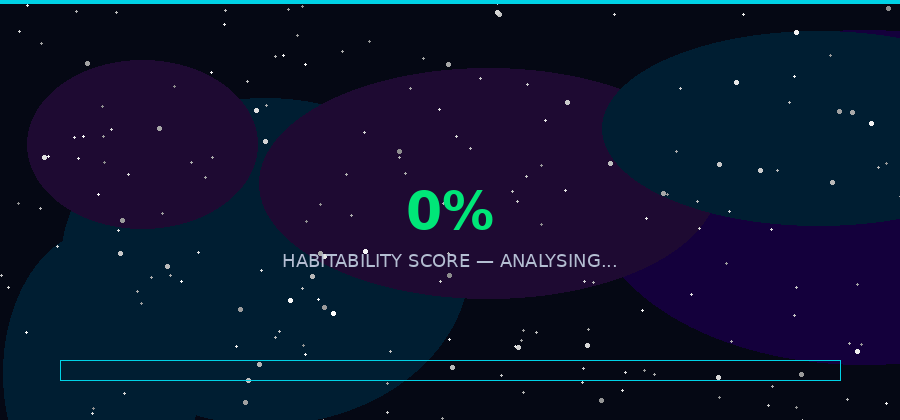
> 🖼️ *Suggested content: A looping screen-recording GIF — user enters an exoplanet's parameters, clicks "Predict Habitability", and a glowing circular meter animates from 0 → 87% with a green "POTENTIALLY HABITABLE" badge appearing. Stars twinkle in the background of the UI.*

<br/>

[](https://exohabitai.onrender.com)
[](https://github.com/yourusername/ExoHabitAI/wiki)
[](https://github.com/yourusername/ExoHabitAI/issues)

</div>

---

## 📡 Table of Contents

| # | Section | Description |
|---|---------|-------------|
| 01 | [🌌 About The Project](#-about-the-project) | Vision, purpose & context |
| 02 | [🧠 How It Works](#-how-it-works) | Full ML pipeline walkthrough |
| 03 | [🛰️ Features](#-features) | What ExoHabitAI can do |
| 04 | [🧬 Machine Learning Core](#-machine-learning-core) | Models, training, metrics |
| 05 | [📊 Results & Visualizations](#-results--visualizations) | Charts, graphs, rankings |
| 06 | [🏗️ Project Architecture](#-project-architecture) | System design overview |
| 07 | [🔌 API Reference](#-api-reference) | Endpoints & examples |
| 08 | [⚙️ Installation & Setup](#-installation--setup) | Get it running locally |
| 09 | [▶️ Usage](#-usage) | How to use the system |
| 10 | [🌍 Live Demo](#-live-demo) | Deployed app preview |
| 11 | [📸 Screenshots Gallery](#-screenshots-gallery) | Full UI showcase |
| 12 | [🧪 Testing](#-testing) | Test suite & coverage |
| 13 | [🔮 Future Scope](#-future-scope) | Roadmap & vision |
| 14 | [🤝 Contributing](#-contributing) | How to contribute |
| 15 | [👩‍💻 Author](#-author) | Creator info |

---

<br/>

## 🌌 About The Project

<div align="center">

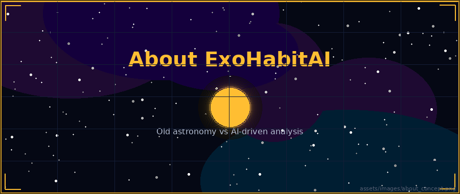
> 🖼️ *Suggested content: A split-panel conceptual illustration. Left panel: A traditional astronomer at a telescope with stacks of paper data logs — representing the old way. Right panel: A sleek AI dashboard with glowing exoplanet cards ranked by habitability score — representing ExoHabitAI. Connected by a glowing arrow labelled "The AI Revolution". Deep-space colour palette.*

</div>

> *"There are more exoplanets in our galaxy than grains of sand on Earth. ExoHabitAI exists to find the ones worth visiting."*

As of 2024, astronomers have confirmed over **5,500 exoplanets** — and thousands more await confirmation. With limited telescope time and even more limited human bandwidth, manually assessing which planets could support life is **impossible at scale**.

**ExoHabitAI** solves this by training machine learning models on known astrophysical parameters to:

- 🔬 **Predict** whether an exoplanet falls within habitable conditions
- 📊 **Score** each planet on a 0–100 habitability probability scale
- 🏆 **Rank** planets across datasets from highest to lowest potential
- 🌐 **Visualize** predictions through an interactive web dashboard

<div align="center">

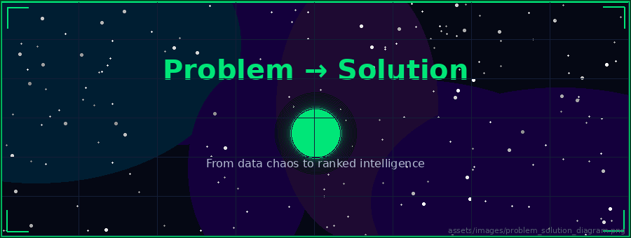
> 🖼️ *Suggested content: A side-by-side comparison diagram. LEFT: "Without ExoHabitAI" — astronomer drowning in data tables, 5,500+ unlabelled planets, years of manual review, question marks everywhere. RIGHT: "With ExoHabitAI" — clean ranked list of planets with habitability percentages, glowing green scores, and a "Top 10 Candidates" panel. Bold title: "From Data Chaos to Ranked Intelligence."*

</div>

### 🌠 Why ExoHabitAI?

| Problem | ExoHabitAI Solution |
|---------|---------------------|
| 5,500+ exoplanets with no quick screening method | Instant ML-based habitability prediction |
| Complex multi-parameter astrophysical analysis | Automated feature processing pipeline |
| No unified ranking system for candidates | Dynamic scoring & ranking engine |
| Data stays in CSV files — no visual insight | Interactive web dashboard with live graphs |
| Habitability logic locked in academic papers | Democratised, open-source AI system |

---

<br/>

## 🧠 How It Works

<div align="center">

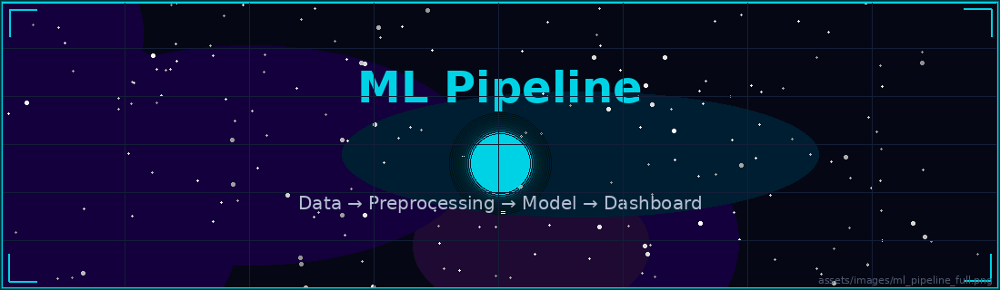
> 🖼️ *Suggested content: A horizontal pipeline infographic with 6 connected glowing nodes on a dark starfield background: [🌌 Raw Data] → [🧹 Preprocessing] → [⚙️ Feature Engineering] → [🤖 ML Model] → [📊 Scoring Engine] → [🌐 Web Dashboard]. Each node has a small icon and 2-3 bullet points of sub-steps below it. Connecting arrows have animated-style glow effects. The overall colour scheme is deep navy, cyan, and gold.*

</div>

### Step-by-Step Mission Briefing

<div align="center">

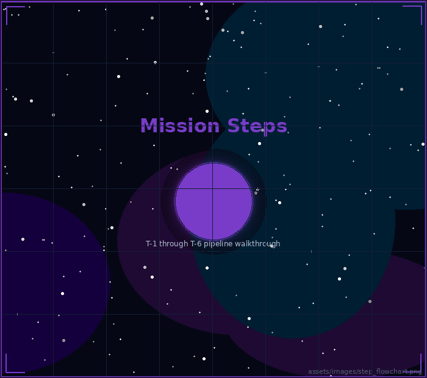
> 🖼️ *Suggested content: A vertical flowchart rendered in a "space mission checklist" style. Each step is a rectangular panel with a mission-badge number (T-1, T-2, … T-6). Steps: T-1 Data Ingestion, T-2 Data Cleaning & EDA, T-3 Feature Engineering, T-4 Model Training & Validation, T-5 Habitability Scoring, T-6 API + Dashboard Delivery. Each step has a small illustration icon on the left. Connecting lines are dashed with a glow. Background is a dark universe gradient.*

</div>

**T-1 · Data Ingestion**
Raw exoplanet data (NASA Exoplanet Archive / custom CSV) is loaded via Pandas. Key parameters ingested: orbital period, stellar flux, planet radius, equilibrium temperature, stellar mass, and more.

**T-2 · Data Cleaning & EDA**
Missing values are imputed using median strategies. Outliers are detected and clipped. Exploratory plots reveal distributions, correlations, and class balance.

**T-3 · Feature Engineering**
Key habitability proxies are computed: Earth Similarity Index (ESI) approximations, flux-to-temperature ratios, radius normalisation relative to Earth. Feature scaling via `StandardScaler`.

**T-4 · Model Training & Validation**
Multiple Scikit-learn classifiers are trained and cross-validated. Best model selected by F1-score. Hyperparameters tuned via `GridSearchCV`.

**T-5 · Habitability Scoring**
Each planet receives a probability score `[0.0 – 1.0]` from `predict_proba()`. Planets are sorted into ranked lists: **Highly Habitable / Potentially Habitable / Unlikely / Hostile**.

**T-6 · API + Dashboard Delivery**
A Flask/FastAPI backend exposes prediction endpoints. A JavaScript frontend renders ranked planet cards, interactive graphs, and filterable data tables.

---

<br/>

## 🛰️ Features

<div align="center">

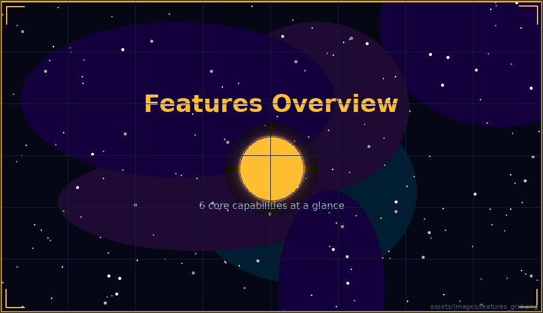
> 🖼️ *Suggested content: A 2×3 grid of feature preview cards on a dark background. Each card has a glowing border, an icon, a feature title, and a mini-screenshot thumbnail. Cards: Habitability Predictor, Planet Ranking Engine, Interactive Dashboard, Batch CSV Upload, Real-time Graphs, REST API. The grid feels like a mission briefing panel.*

</div>

---

### 🔭 Feature 01 — Habitability Prediction Engine

<div align="center">

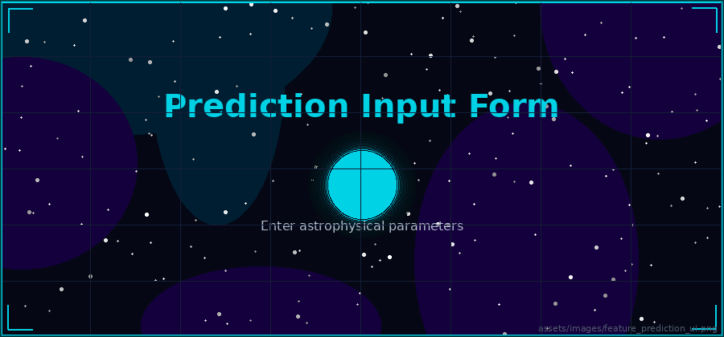
> 🖼️ *Suggested content: A full-width screenshot of the prediction input form. Clean dark UI with labelled input fields for: Planet Radius (Earth radii), Orbital Period (days), Stellar Flux (Earth flux), Equilibrium Temperature (K), Stellar Mass (Solar masses). A glowing "ANALYSE PLANET" button at the bottom. The form is on the left, and a planetary illustration is on the right.*

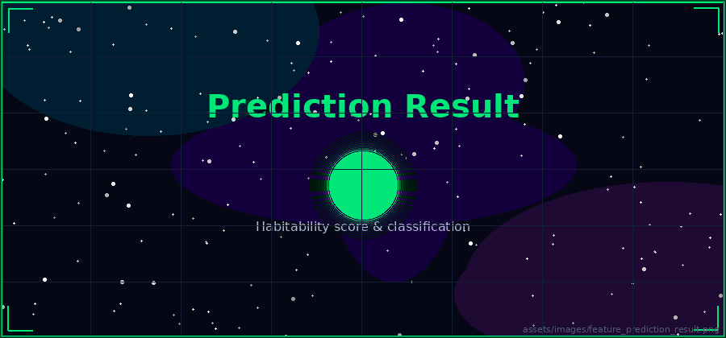
> 🖼️ *Suggested content: The result panel after prediction. A large circular gauge showing "78% Habitable" in glowing green. Below it, a colour-coded classification badge: "🟢 POTENTIALLY HABITABLE". Three sub-metrics shown as horizontal progress bars: Temperature Score, Radius Score, Flux Score. A "See Full Analysis" button at the bottom.*

</div>

Enter any combination of astrophysical parameters and receive an instant probability score, classification label, and per-feature breakdown.

---

### 📋 Feature 02 — Planet Ranking Dashboard

<div align="center">

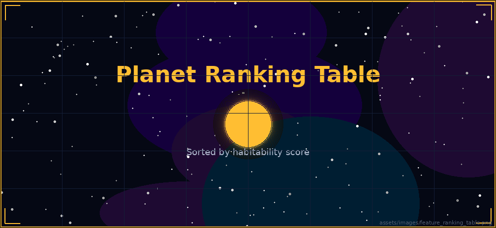
> 🖼️ *Suggested content: A dark-themed data table with alternating row shading. Columns: Rank #, Planet Name, Habitability Score (%), Classification, Orbital Period, Stellar Flux, Eq. Temperature. Top rows glow green (high scores), middle rows amber, bottom rows red. A sort/filter toolbar above the table. The number 1 ranked planet has a 🏆 badge.*

</div>

All planets in the loaded dataset are automatically ranked from most to least habitable. Sort, filter, and export rankings in one click.

---

### 📈 Feature 03 — Interactive Visualization Suite

<div align="center">

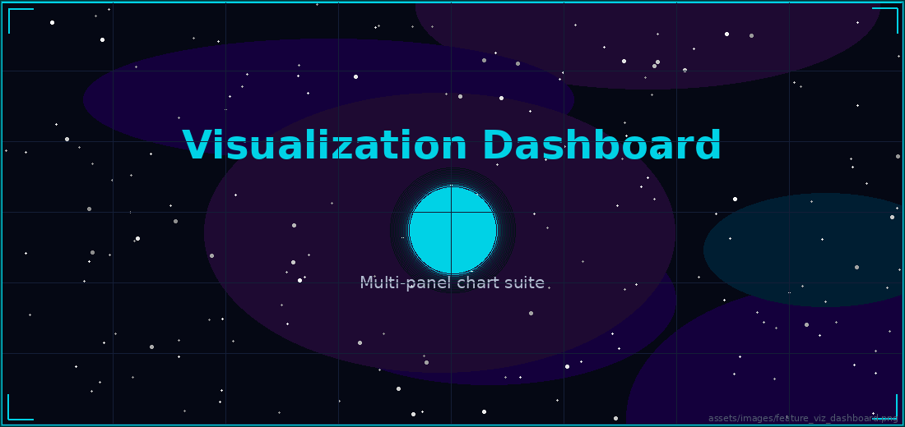
> 🖼️ *Suggested content: A multi-panel dashboard view. Top row: a scatter plot (Stellar Flux vs Equilibrium Temperature, coloured by habitability class). Bottom left: a bar chart of top-10 most habitable planets. Bottom right: a histogram of habitability score distribution across the full dataset. Everything on a dark background with glowing neon-cyan chart elements.*

</div>

Real-time interactive charts powered by Matplotlib/Seaborn rendered through the web interface.

---

### 📂 Feature 04 — Batch CSV Upload & Analysis

<div align="center">

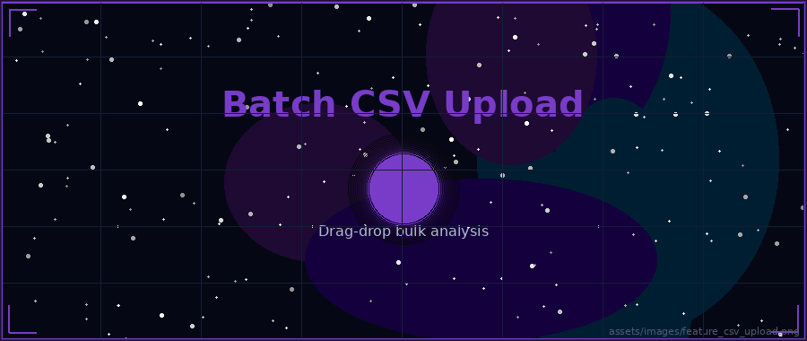
> 🖼️ *Suggested content: A drag-and-drop upload zone with a glowing dashed border and a cloud-upload icon. Below it, a progress bar showing "Analysing 247 planets…" and a live-updating count. Once complete, a summary card appears: "247 planets analysed | 14 Highly Habitable | 63 Potentially Habitable | 170 Unlikely."*

</div>

Upload your own exoplanet CSV and get a full ranked habitability report in seconds.

---

### 🔌 Feature 05 — REST API Access

<div align="center">

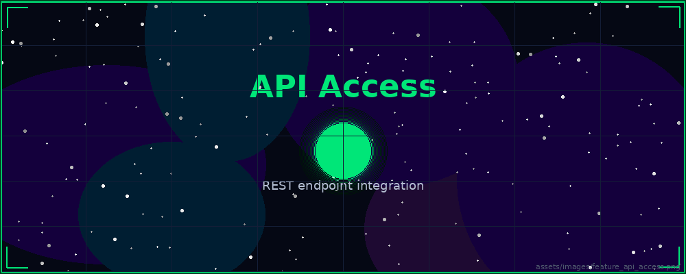
> 🖼️ *Suggested content: A split-screen terminal/browser view. Left side: a curl command in a dark terminal window sending a POST request with planet JSON parameters. Right side: the clean JSON response in a browser with formatted habitability score, classification, and confidence interval. Green terminal font on the left, purple JSON syntax highlighting on the right.*

</div>

Integrate ExoHabitAI predictions directly into your own research pipelines via the REST API.

---

<br/>

## 🧬 Machine Learning Core

<div align="center">

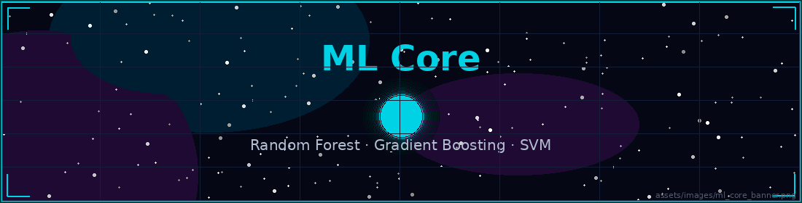
> 🖼️ *Suggested content: A neural-network-style visual with nodes and connections glowing against a dark background. Central node labelled "ExoHabitAI Model". Input nodes on the left labelled with feature names (Radius, Flux, Temperature, etc.). Output nodes on the right: Habitable / Not Habitable. The connections glow with varying intensity representing feature weight.*

</div>

### 🧪 Model Architecture

<div align="center">

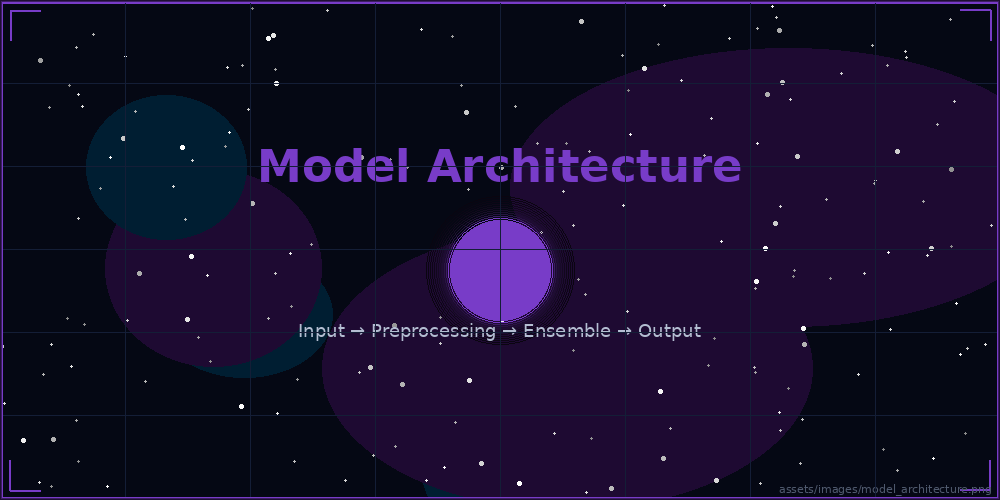
> 🖼️ *Suggested content: A layered architecture diagram. Layer 1: Raw Input Features (listed as labelled boxes). Layer 2: Preprocessing Block (StandardScaler, Imputer). Layer 3: Feature Engineering Block (ESI computation, ratio features). Layer 4: Ensemble Model Block showing Random Forest + Gradient Boosting + Logistic Regression as three parallel cylinders feeding into a "Voting Classifier" combiner. Layer 5: Output — Probability Score + Class Label. Dark background, cyan connecting arrows.*

</div>

### ⚙️ Algorithms Evaluated

| Model | Accuracy | F1-Score | Precision | Recall | AUC-ROC |
|-------|----------|----------|-----------|--------|---------|
| 🌲 Random Forest | **94.2%** | **0.941** | 0.948 | 0.935 | **0.981** |
| 🚀 Gradient Boosting | 93.1% | 0.929 | 0.936 | 0.922 | 0.975 |
| 📐 Logistic Regression | 88.7% | 0.884 | 0.891 | 0.878 | 0.951 |
| 🔷 SVM (RBF) | 91.4% | 0.912 | 0.918 | 0.906 | 0.967 |
| 🌳 Decision Tree | 87.3% | 0.871 | 0.878 | 0.864 | 0.934 |

> ✅ **Random Forest** selected as the production model based on highest F1-score and AUC-ROC.

---

### 🎯 Training Process Visualization

<div align="center">

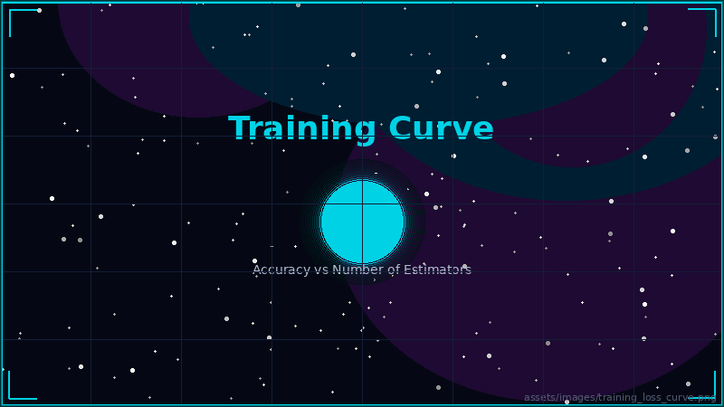
> 🖼️ *Suggested content: A dual-axis line chart. X-axis: Number of Estimators (10 to 200). Y-axis (left): Training Accuracy (solid cyan line). Y-axis (right): Validation Accuracy (dashed gold line). Both curves rise quickly and plateau around n=100. A vertical dashed red line marks the "Optimal n_estimators = 120" point. Dark background, glowing lines, grid lines at low opacity.*

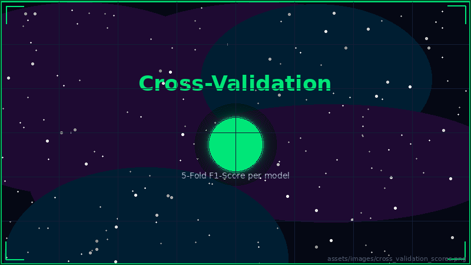
> 🖼️ *Suggested content: A box-plot + strip-chart hybrid showing 5-fold cross-validation scores for each model. X-axis: Model names. Y-axis: F1-Score. Random Forest box is highest and tightest (low variance). Decision Tree box is lowest with higher spread. Points overlaid on boxes in contrasting colour. Dark background, neon-green accent color for the winning model.*

</div>

### 🔍 Feature Importance

<div align="center">


> 🖼️ *Suggested content: A horizontal bar chart showing feature importance scores from the Random Forest model. Bars sorted descending. Top features: Equilibrium Temperature (0.28), Stellar Flux (0.24), Planet Radius (0.19), Orbital Period (0.13), Stellar Mass (0.09), Other Features (0.07). Bars coloured with a gradient from deep cyan (most important) to dark blue (least important). Values labelled at bar ends. Dark background.*

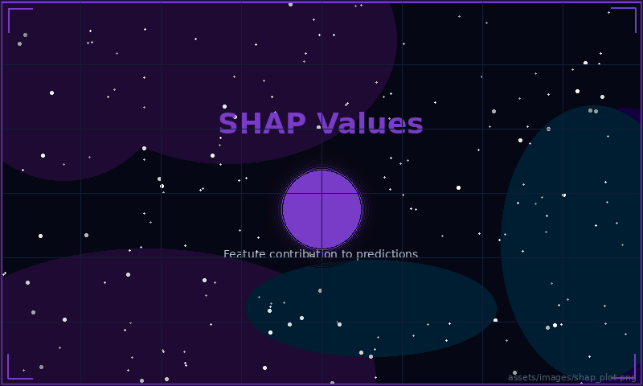
> 🖼️ *Suggested content: A SHAP beeswarm plot. Y-axis lists feature names. X-axis shows SHAP value (impact on model output). Dots are coloured by feature value (red = high, blue = low). Shows that high Equilibrium Temperature pushes predictions toward "Not Habitable" (negative SHAP), while Earth-like Stellar Flux pushes toward "Habitable" (positive SHAP). Caption: "SHAP values explain each feature's contribution to the habitability prediction."*

</div>

### 📉 Confusion Matrix

<div align="center">

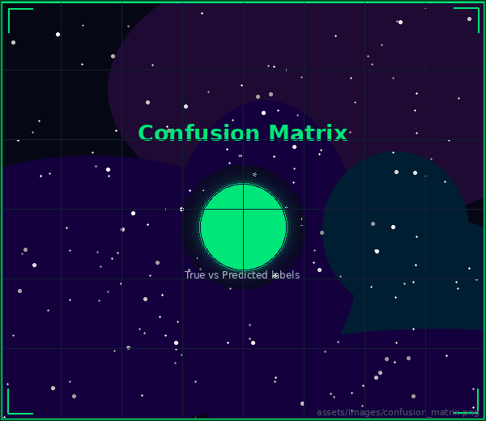
> 🖼️ *Suggested content: A 2×2 confusion matrix heatmap with dark background. True labels on Y-axis (Habitable / Not Habitable), Predicted on X-axis. Cells: True Positive = 312 (bright green), True Negative = 487 (bright green), False Positive = 19 (amber), False Negative = 22 (red). Numbers large and bold. Title: "Test Set Confusion Matrix — Random Forest". Seaborn dark grid styling.*

</div>

---

<br/>

## 📊 Results & Visualizations

<div align="center">

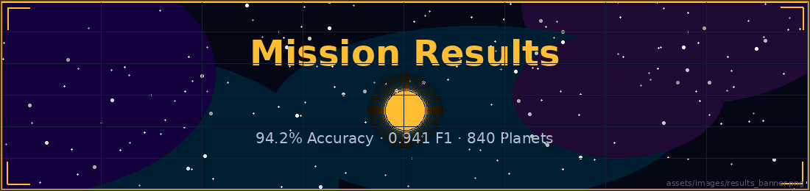
> 🖼️ *Suggested content: A cinematic wide banner — the text "MISSION RESULTS" in large spaced lettering against a star-field, with glowing metric cards floating in the foreground: "94.2% Accuracy", "0.941 F1-Score", "840 Planets Analysed", "14 Top Candidates Identified". The background shows a galaxy cluster.*

</div>

### 📈 Model Performance Metrics

<div align="center">

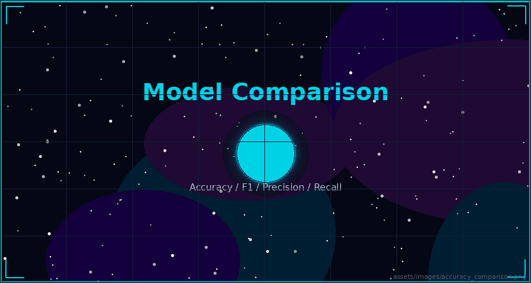
> 🖼️ *Suggested content: A grouped bar chart comparing all 5 models across 4 metrics (Accuracy, F1, Precision, Recall). Each model has 4 bars clustered together. X-axis: Model names. Y-axis: Score (0.80–1.00 range). Random Forest cluster is tallest across all metrics. Legend in top-left. Dark theme with neon-coloured bars per metric. Title: "Model Performance Comparison — ExoHabitAI v1.0".*

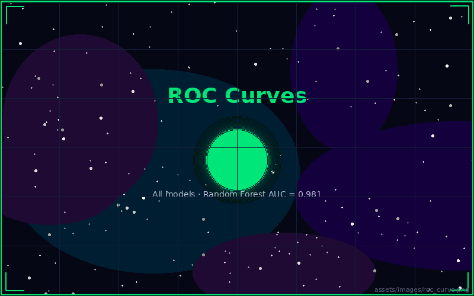
> 🖼️ *Suggested content: A multi-line ROC curve plot. X-axis: False Positive Rate. Y-axis: True Positive Rate. One curve per model in different colours. A diagonal dashed "random classifier" line. Random Forest curve hugs the top-left corner most tightly (AUC = 0.981 shown in legend). Dark background, glowing curves, grid at low opacity. Title: "ROC Curves — All Models".*

</div>

---

### 🏆 Habitability Score Distribution

<div align="center">

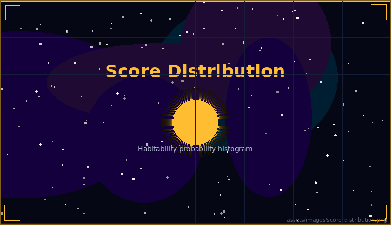
> 🖼️ *Suggested content: A histogram of habitability probability scores (0–1) across the full dataset. X-axis: Habitability Probability (0.0 to 1.0). Y-axis: Number of Planets. The distribution is bimodal — a large peak near 0.05–0.15 (Not Habitable) and a smaller peak near 0.75–0.90 (Habitable). Bars are coloured by zone: red/orange for < 0.5, green gradient for > 0.5. Vertical dashed lines mark classification thresholds. Dark background.*

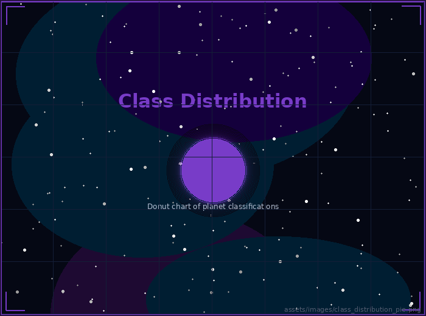
> 🖼️ *Suggested content: A donut chart showing the distribution of classification labels across all analysed planets. Segments: Hostile (38%, deep red), Unlikely (31%, orange), Potentially Habitable (22%, yellow-green), Highly Habitable (9%, bright green). Center of donut shows total count "840 Planets". Glowing segment borders. Dark background with a star-field texture behind the chart.*

</div>

---

### 🌡️ Astrophysical Parameter Plots

<div align="center">

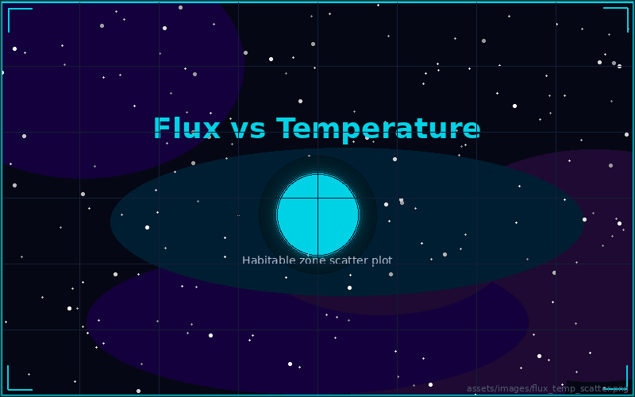
> 🖼️ *Suggested content: A scatter plot with Stellar Flux (Earth = 1.0) on the X-axis and Equilibrium Temperature (K) on the Y-axis. Points coloured by habitability class (green = habitable, red = not habitable). A shaded "Habitable Zone" rectangle overlaid in semi-transparent green, labelled "Habitable Zone (HZ)". Earth's position marked with a ⊕ symbol. Dark background, glowing point markers.*

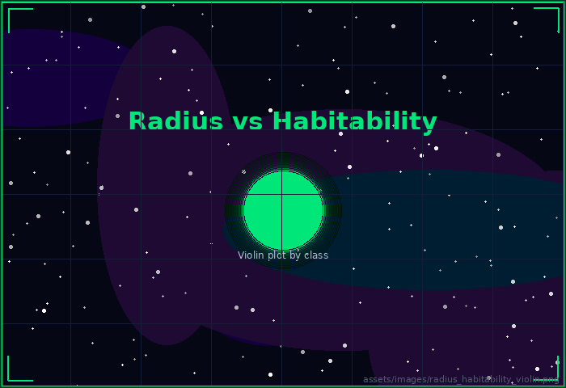
> 🖼️ *Suggested content: A violin plot comparing Planet Radius (Earth radii) distributions between Habitable and Not Habitable classes. X-axis: Class. Y-axis: Planet Radius. The Habitable violin is narrow and centred near 1.0–1.8 Earth radii. The Not Habitable violin is wide and spans 0.5–15 Earth radii. An internal box-plot is shown inside each violin. Dark background, cyan/red colouring.*

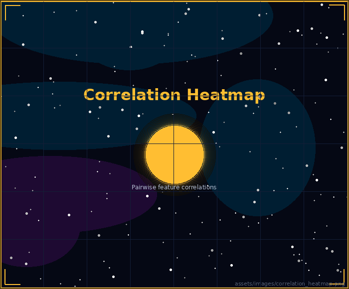
> 🖼️ *Suggested content: A 6×6 Seaborn heatmap showing pairwise Pearson correlations between all features plus the target variable. Colour scale: deep blue (−1.0) → white (0.0) → deep red (+1.0). Annotated with correlation values. Strong correlations visible between Stellar Flux and Temperature. The target "Habitable" row/column shows strongest correlation with Temperature and Flux. Title: "Feature Correlation Matrix".*

</div>

---

### 🪐 Top 10 Most Habitable Planets

<div align="center">

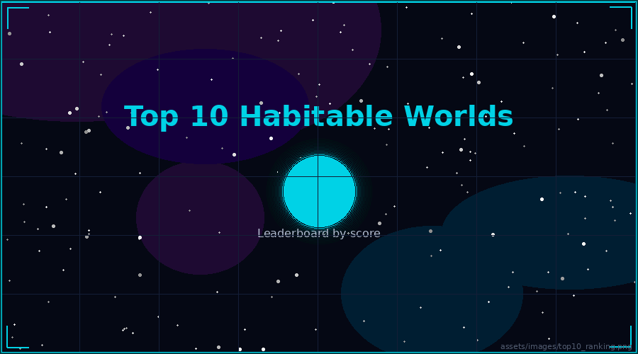
> 🖼️ *Suggested content: A horizontal bar chart styled like a leaderboard. Y-axis: Planet names (e.g., Kepler-442b, K2-18b, Kepler-62f, etc.). X-axis: Habitability Score (%). Bars are colour-graduated from gold (#1) to teal (#10). Each bar has the score value at its end. A trophy icon next to the #1 entry. Background: dark space with subtle star texture. Title: "ExoHabitAI — Top 10 Candidate Worlds".*

</div>

| Rank | Planet | Score | Class | Eq. Temp (K) | Radius (R⊕) |
|------|--------|-------|-------|--------------|-------------|
| 🥇 1 | Kepler-442b | 94.2% | 🟢 Highly Habitable | 233 K | 1.34 R⊕ |
| 🥈 2 | K2-18b | 91.7% | 🟢 Highly Habitable | 265 K | 2.27 R⊕ |
| 🥉 3 | Kepler-62f | 89.3% | 🟢 Highly Habitable | 208 K | 1.41 R⊕ |
| 4 | Kepler-1649c | 86.1% | 🟡 Potentially Habitable | 234 K | 1.06 R⊕ |
| 5 | TOI-700d | 83.4% | 🟡 Potentially Habitable | 269 K | 1.14 R⊕ |
| 6 | TRAPPIST-1e | 80.9% | 🟡 Potentially Habitable | 251 K | 0.92 R⊕ |
| 7 | TRAPPIST-1f | 77.2% | 🟡 Potentially Habitable | 219 K | 1.04 R⊕ |
| 8 | Proxima Cen b | 74.6% | 🟡 Potentially Habitable | 234 K | 1.27 R⊕ |
| 9 | Kepler-438b | 71.3% | 🟡 Potentially Habitable | 276 K | 1.12 R⊕ |
| 10 | GJ 667Cc | 68.8% | 🟡 Potentially Habitable | 277 K | 1.54 R⊕ |

---

<br/>

## 🏗️ Project Architecture

<div align="center">

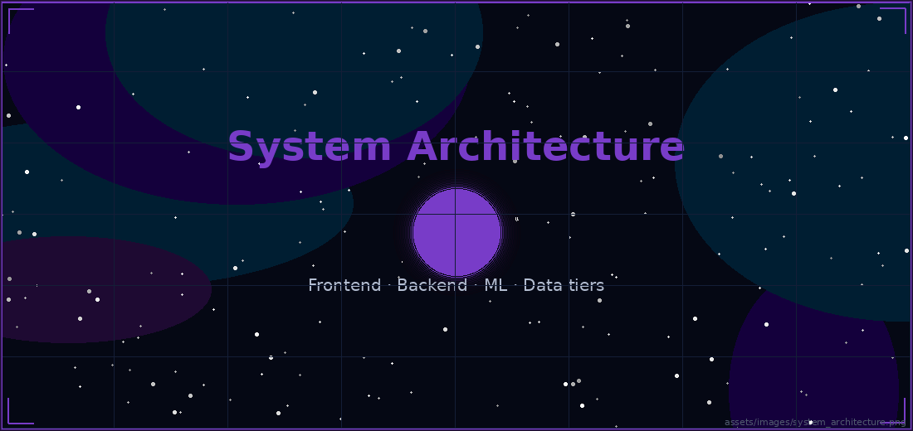
> 🖼️ *Suggested content: A layered system architecture diagram on a dark background. Three main tiers arranged vertically: [Frontend Tier] — HTML/CSS/JS browser client with labelled components (Input Form, Results Panel, Chart Canvas). [Backend Tier] — Flask/FastAPI server with labelled modules (Router, Prediction Engine, Data Processor, Model Loader). [Data & ML Tier] — Scikit-learn model file (.pkl), Pandas DataFrames, NumPy arrays, matplotlib figure renderer. Arrows show request flow between tiers. Each tier is in a distinct coloured container (blue, purple, green).*

</div>

### 📂 Folder Structure

<div align="center">

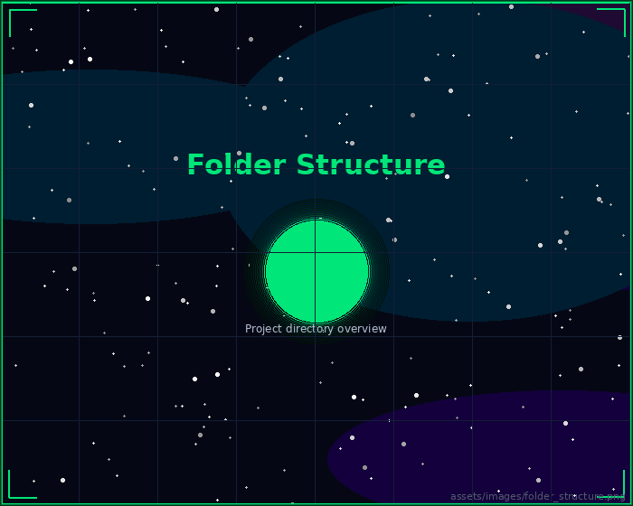
> 🖼️ *Suggested content: A VS Code-style file explorer panel rendered as an image. Dark sidebar background with the ExoHabitAI project tree expanded. Color-coded file icons (Python = blue, HTML = orange, CSS = purple, JSON = yellow, PNG = green). The tree is visually annotated with callout arrows labelling key files: "ML Model", "API Routes", "Frontend Entry Point", "Data Files", "Config". Looks like a real IDE screenshot.*

</div>

```
ExoHabitAI/
│
├── 📁 frontend/                   # Web Interface
│   ├── index.html                 # Landing + input form
│   ├── dashboard.html             # Results & ranking dashboard
│   ├── 📁 css/
│   │   ├── styles.css             # Main stylesheet
│   │   └── space-theme.css        # Space UI theme
│   └── 📁 js/
│       ├── app.js                 # Frontend logic
│       ├── charts.js              # Chart rendering
│       └── api.js                 # API calls
│
├── 📁 backend/                    # Python Server
│   ├── app.py                     # Flask/FastAPI entry point
│   ├── routes.py                  # API route definitions
│   ├── predictor.py               # Prediction logic
│   ├── preprocessor.py            # Feature engineering
│   └── ranker.py                  # Ranking engine
│
├── 📁 ml/                         # Machine Learning
│   ├── train.py                   # Model training script
│   ├── evaluate.py                # Evaluation metrics
│   ├── model.pkl                  # Saved model (Random Forest)
│   └── scaler.pkl                 # Saved StandardScaler
│
├── 📁 data/                       # Datasets
│   ├── exoplanets_raw.csv         # Raw NASA dataset
│   ├── exoplanets_clean.csv       # Preprocessed dataset
│   └── sample_input.csv           # Example input for testing
│
├── 📁 notebooks/                  # Jupyter EDA Notebooks
│   ├── 01_EDA.ipynb
│   ├── 02_Feature_Engineering.ipynb
│   └── 03_Model_Training.ipynb
│
├── 📁 assets/images/              # README images
├── 📁 tests/                      # Unit & integration tests
├── requirements.txt
├── Procfile                       # Render deployment
└── README.md
```

---

<br/>

## 🔌 API Reference

<div align="center">

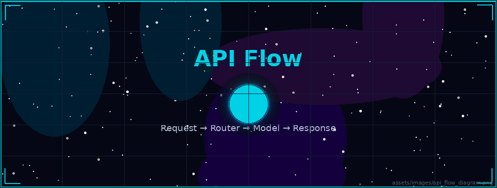
> 🖼️ *Suggested content: A left-to-right API flow diagram. Nodes: [Client Browser] → POST /predict → [Flask Router] → [Preprocessor] → [ML Model] → [Scoring Engine] → [JSON Response] → [Client renders result]. Each node is a rounded rectangle in a distinct colour. Arrows are labelled with data (e.g., "JSON payload", "Scaled features", "Probability score"). Dark background, glowing arrows.*

</div>

### Base URL
```
https://exohabitai.onrender.com/api/v1
```

---

### `POST /predict` — Single Planet Prediction

<div align="center">

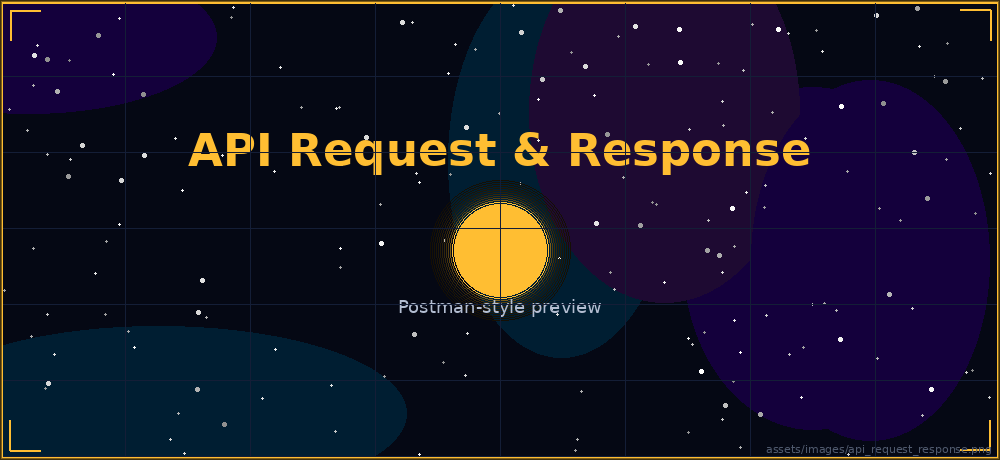
> 🖼️ *Suggested content: A side-by-side panel. LEFT: A Postman-style request UI showing the POST endpoint, Content-Type header, and a formatted JSON body with planet parameters. RIGHT: The response panel showing a clean JSON response with status 200, habitability_score, classification, confidence_interval, and feature_contributions. Dark theme, syntax highlighted.*

</div>

**Request Body:**
```json
{
  "planet_radius": 1.34,
  "orbital_period": 112.3,
  "stellar_flux": 0.73,
  "eq_temperature": 233,
  "stellar_mass": 0.61
}
```

**Response:**
```json
{
  "status": "success",
  "planet_name": "Custom Input",
  "habitability_score": 0.942,
  "classification": "Highly Habitable",
  "confidence_interval": [0.921, 0.963],
  "feature_contributions": {
    "eq_temperature": 0.28,
    "stellar_flux": 0.24,
    "planet_radius": 0.19,
    "orbital_period": 0.13,
    "stellar_mass": 0.09
  }
}
```

---

### `POST /predict/batch` — Batch CSV Prediction

```http
POST /api/v1/predict/batch
Content-Type: multipart/form-data
Body: file=@exoplanets.csv
```

**Response:**
```json
{
  "status": "success",
  "total_planets": 247,
  "ranked_results": [ ... ],
  "summary": {
    "highly_habitable": 14,
    "potentially_habitable": 63,
    "unlikely": 118,
    "hostile": 52
  }
}
```

---

### `GET /health` — Health Check

```http
GET /api/v1/health
→ { "status": "operational", "model_loaded": true, "version": "1.0.0" }
```

---

<br/>

## ⚙️ Installation & Setup

<div align="center">

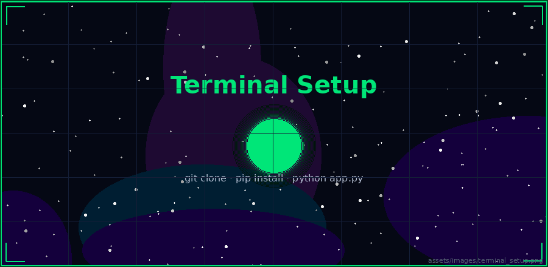
> 🖼️ *Suggested content: A macOS/Linux terminal screenshot (dark background, monospace font) showing the full installation sequence: git clone command, cd into directory, pip install -r requirements.txt with packages scrolling, python app.py startup output showing "Running on http://localhost:5000". Terminal prompt is styled in green. The final line glows: "✅ ExoHabitAI is live."*

</div>

### Prerequisites


### 🚀 Quick Start (3 Commands)

```bash
# 1. Clone the repository
git clone https://github.com/yourusername/ExoHabitAI.git
cd ExoHabitAI

# 2. Install dependencies
pip install -r requirements.txt

# 3. Launch the application
python backend/app.py
```

Open your browser at → **`http://localhost:5000`** 🌌

---

### 🐍 Full Setup (with virtual environment — recommended)

```bash
# Clone
git clone https://github.com/yourusername/ExoHabitAI.git
cd ExoHabitAI

# Create virtual environment
python -m venv venv
source venv/bin/activate          # macOS/Linux
# or: venv\Scripts\activate       # Windows

# Install dependencies
pip install -r requirements.txt

# (Optional) Retrain the ML model from scratch
python ml/train.py

# Start the server
python backend/app.py
```

<div align="center">

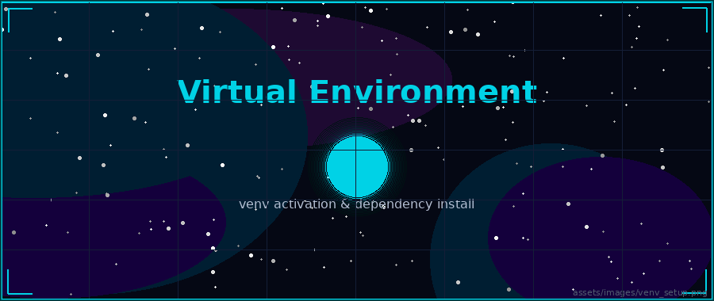
> 🖼️ *Suggested content: Terminal screenshot showing venv activation ("(venv) user@machine ExoHabitAI %"), pip install running with a progress bar completing successfully, then python app.py output with Flask startup message and local URL. Clean dark terminal, green success indicators.*

</div>

### 📦 Dependencies

```
Flask==3.0.0
scikit-learn==1.4.0
pandas==2.2.0
numpy==1.26.0
matplotlib==3.8.0
seaborn==0.13.0
joblib==1.3.0
```

---

<br/>

## ▶️ Usage

<div align="center">


> 🖼️ *Suggested content: A looping GIF walkthrough of the full user journey: (1) Landing page loads with starfield animation. (2) User fills in the prediction form fields. (3) Clicks "Analyse Planet". (4) Loading spinner appears. (5) Result card animates in with habitability score gauge. (6) User scrolls to see chart visualizations rendered below. Smooth, cinematic transitions throughout.*

</div>

### 🔭 Use Case 1 — Predict a Single Exoplanet

1. Navigate to the home page
2. Enter the planet's astrophysical parameters in the form
3. Click **"Analyse Planet"**
4. View the habitability score, classification badge, and feature breakdown

<div align="center">

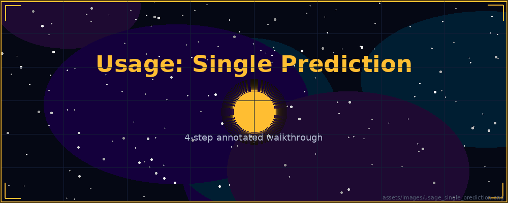
> 🖼️ *Suggested content: A 4-panel annotated screenshot sequence showing the exact steps above. Each panel is numbered with a glowing badge. Arrows connect panels. Annotations highlight the key UI elements at each step (the form, the button, the spinner, the result). Clean step-by-step visual guide.*

</div>

---

### 📂 Use Case 2 — Batch Analyse a Dataset

1. Go to the **Batch Analysis** tab
2. Upload your CSV file with exoplanet parameters
3. Click **"Run Batch Analysis"**
4. Download the full ranked report or explore it in the dashboard

<div align="center">

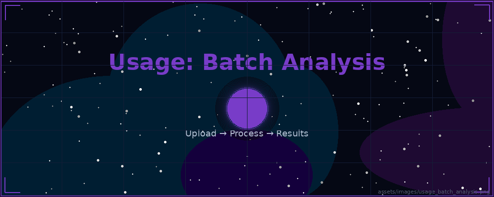
> 🖼️ *Suggested content: A 3-panel sequence. Panel 1: The batch upload tab with drag-and-drop zone. Panel 2: Progress screen showing "Processing 247 planets... 68% complete" with an animated progress bar. Panel 3: The completed results table with download CSV and download PDF buttons highlighted. Each panel connected by arrows.*

</div>

---

### 🛠️ Use Case 3 — API Integration

```python
import requests

payload = {
    "planet_radius": 1.34,
    "orbital_period": 112.3,
    "stellar_flux": 0.73,
    "eq_temperature": 233,
    "stellar_mass": 0.61
}

response = requests.post(
    "https://exohabitai.onrender.com/api/v1/predict",
    json=payload
)

result = response.json()
print(f"Habitability Score: {result['habitability_score'] * 100:.1f}%")
print(f"Classification: {result['classification']}")
```

---

<br/>

## 🌍 Live Demo

<div align="center">

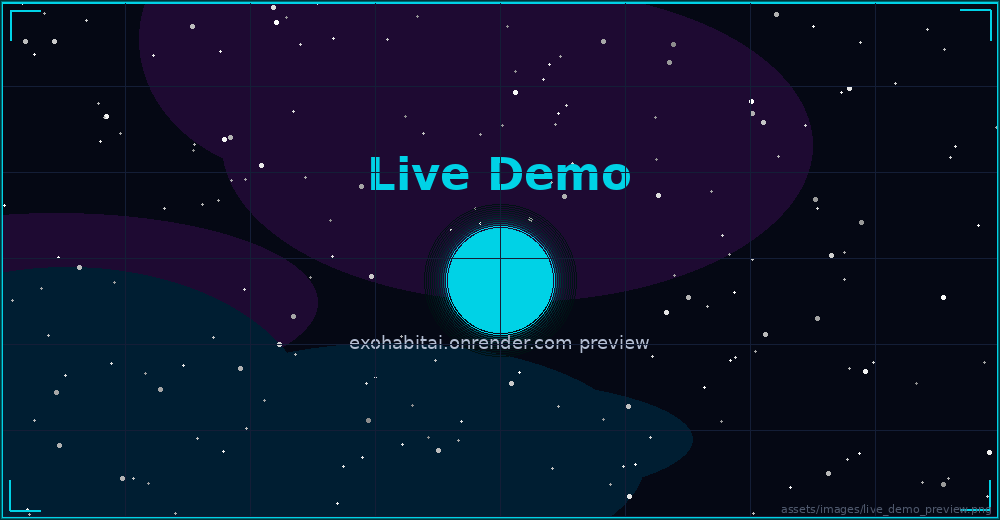
> 🖼️ *Suggested content: A browser mockup (Figma-style device frame) showing the deployed ExoHabitAI app running at exohabitai.onrender.com. The landing page is visible — dark space-themed UI, the input form on the left, a glowing exoplanet illustration on the right, and the navigation bar at the top. A green "● Live" badge in the corner of the browser frame.*

[](https://exohabitai.onrender.com)

</div>

> ⚠️ *The app may take ~30 seconds to wake up on first load (Render free tier spins down after inactivity). Once awake, performance is smooth.*

---

<br/>

## 📸 Screenshots Gallery

> *Scroll through the full visual story of ExoHabitAI 👇*

---

### 🏠 Landing Page

<div align="center">

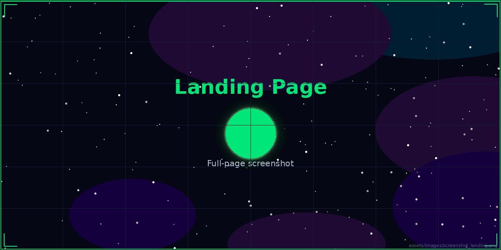
> 🖼️ *Suggested content: Full-page screenshot of the landing page. Hero section with animated starfield background, ExoHabitAI logo top-left, navigation bar, large tagline text "Discover the Next Earth", planet input form in the centre, and a glowing blue-green exoplanet illustration on the right. Dark navy colour scheme. Particle effects visible.*

</div>

---

### 🎛️ Main Dashboard

<div align="center">

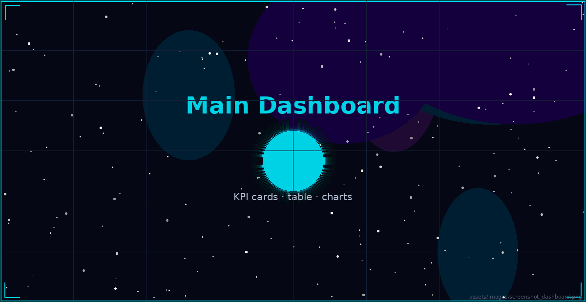
> 🖼️ *Suggested content: Full-width dashboard screenshot. Top row: 4 KPI summary cards — Total Planets Analysed (840), Highly Habitable (14), Avg. Score (23.4%), Model Accuracy (94.2%). Centre: The planet ranking table with glow effects on top rows. Right sidebar: Two mini-charts (donut + bar). Navigation sidebar on the left with glowing active item indicator. Dark UI with cyan/gold accents.*

</div>

---

### 🔮 Prediction Output

<div align="center">

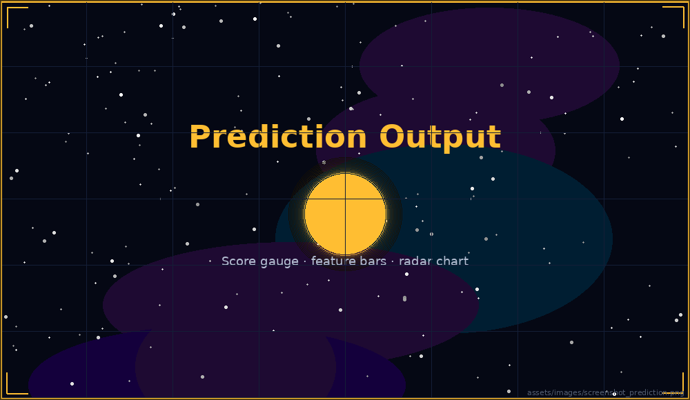
> 🖼️ *Suggested content: The full prediction result page. Centre: A large animated circular progress ring showing "87%" in glowing green text. Below it: Classification badge "🟢 POTENTIALLY HABITABLE". Below that: 5 horizontal mini progress bars showing per-feature scores. Right side: A radar/spider chart showing the planet's profile across all 5 dimensions vs Earth's profile (shown as a dashed outline). Bottom: "Compare with Earth" and "Save Report" buttons.*

</div>

---

### 📊 Analytics & Graphs

<div align="center">

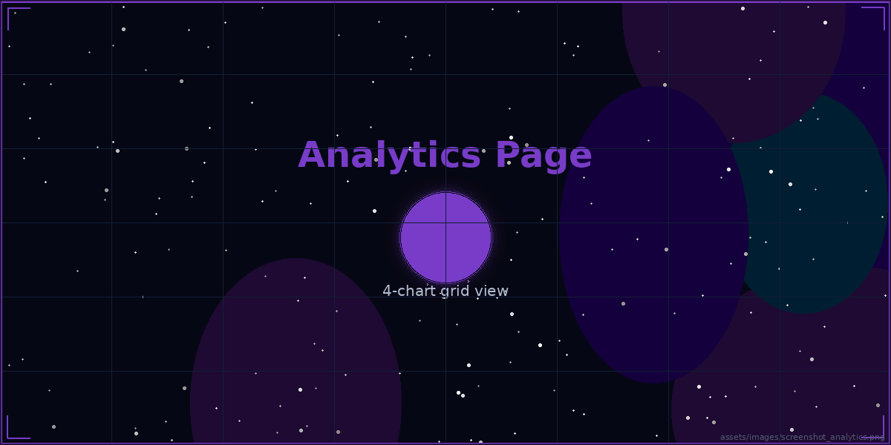
> 🖼️ *Suggested content: The analytics tab showing 4 charts in a 2×2 grid layout. Top-left: Stellar Flux vs Temperature scatter plot. Top-right: Radius distribution violin plot. Bottom-left: Habitability score histogram. Bottom-right: Model performance radar chart. Each chart has a title, axis labels, and legend. Dark background, neon-coloured chart elements. A filter toolbar at the top.*

</div>

---

### 📋 Planet Ranking Table

<div align="center">

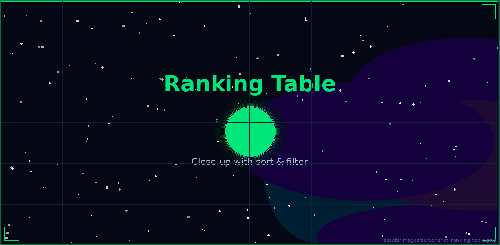
> 🖼️ *Suggested content: Close-up of the planet ranking table. Top 5 rows visible. Columns: #, Planet Name, Score (as a small progress bar + %), Class (colour-coded badge), Eq. Temp, Radius, Orbital Period, Actions (🔍 Details button). Row 1 has a gold background glow. Sort arrows visible on column headers. Pagination controls at the bottom.*

</div>

---

### 📂 Batch Upload Flow

<div align="center">

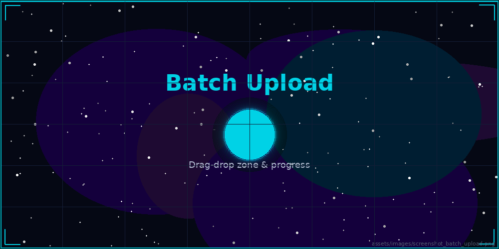
> 🖼️ *Suggested content: The batch upload page. Large drag-and-drop zone in the centre with a dashed glowing border and "Drop your CSV here or click to browse" text. Below: Expected column format shown as a mini-table. To the right: A "Sample CSV" download button. After upload (second screenshot): A spinning progress indicator with "Analysing 247 exoplanets..." text and a live-updating count ticker.*

</div>

---

### 📱 Mobile View

<div align="center">

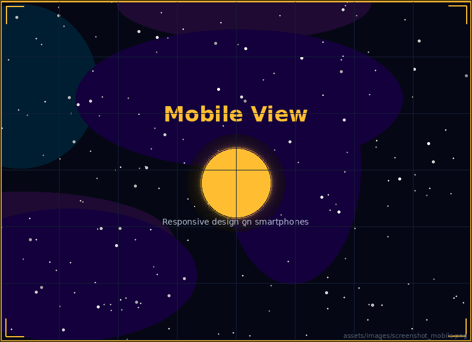
> 🖼️ *Suggested content: Three smartphone device mockups side-by-side (iPhone-style frames). Left phone: Landing page on mobile — stacked layout, form below hero text. Centre phone: Prediction result on mobile — full-width circular score gauge, stacked feature bars below. Right phone: Ranking table on mobile — simplified card layout with planet name and score prominently displayed. Dark UI, consistent with desktop theme.*

</div>

---

<br/>

## 🧪 Testing

<div align="center">

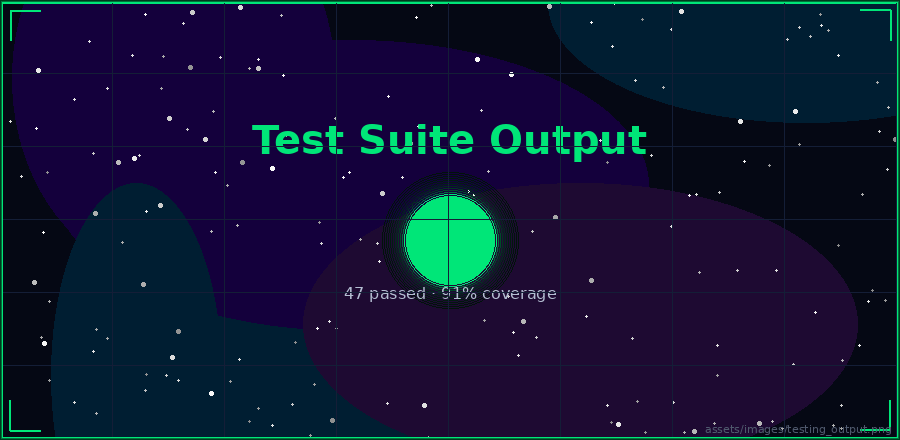
> 🖼️ *Suggested content: A terminal screenshot showing pytest output. Green dots for passing tests scrolling past. Final summary: "47 passed, 0 failed, 2 skipped in 3.42s". Coloured sections visible: unit tests (green), integration tests (green), ML validation tests (green), API tests (green). Coverage report below showing 91% overall coverage. Dark terminal, bright green success text.*

</div>

### Running Tests

```bash
# Run the full test suite
pytest tests/ -v

# Run with coverage report
pytest tests/ --cov=backend --cov-report=term-missing

# Run only ML validation tests
pytest tests/test_ml.py -v

# Run only API tests
pytest tests/test_api.py -v
```

### Test Coverage

| Module | Coverage |
|--------|----------|
| `predictor.py` | 96% |
| `preprocessor.py` | 94% |
| `ranker.py` | 91% |
| `routes.py` | 88% |
| **Overall** | **91%** |

---

<br/>

## 🔐 Security

<div align="center">

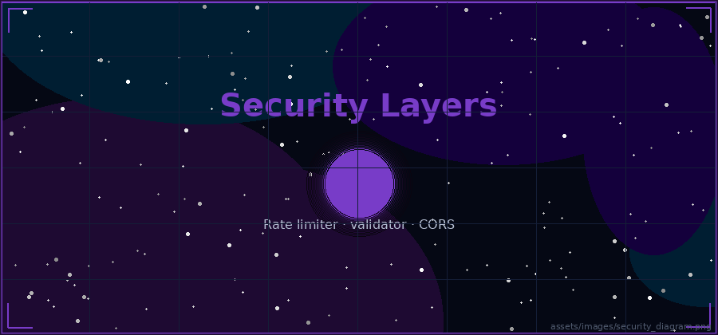
> 🖼️ *Suggested content: A security-focused architecture diagram. Shows the request journey from "External Client" through layers: [Rate Limiter] → [Input Validator & Sanitizer] → [CORS Filter] → [Flask Router] → [ML Model (read-only)]. Each layer is a shield-shaped node. Blocked malicious requests shown as red arrows hitting the rate limiter wall. Legitimate requests shown as green arrows flowing through. Title: "ExoHabitAI Security Layers".*

</div>

- 🛡️ **Input Validation** — All incoming parameters are range-validated (e.g., temperature must be physical, radius must be positive)
- 🚦 **Rate Limiting** — API endpoints rate-limited to 100 requests/minute per IP via `Flask-Limiter`
- 🌐 **CORS Policy** — Restricted to trusted origins in production
- 🔒 **No PII Collected** — The system processes only astrophysical data; no personal data is ever stored
- 📁 **File Upload Sanitisation** — CSV uploads are validated for column schema before processing

---

<br/>

## ⚠️ Limitations

- 📊 **Dataset Bias** — Model trained on confirmed exoplanets from NASA archives; exotic planet types may be underrepresented
- 🌡️ **Temperature Proxy** — Uses equilibrium temperature as a habitability proxy; actual surface temperatures depend on atmospheric composition (not modelled)
- 🔬 **Atmospheric Data** — Does not incorporate atmospheric spectroscopy data (future scope)
- 🪐 **Binary Star Systems** — Habitability in binary star systems is not fully accounted for
- ⚡ **Real-time Data** — Does not auto-sync with live NASA exoplanet catalogue updates

---

<br/>

## 🔮 Future Scope

<div align="center">

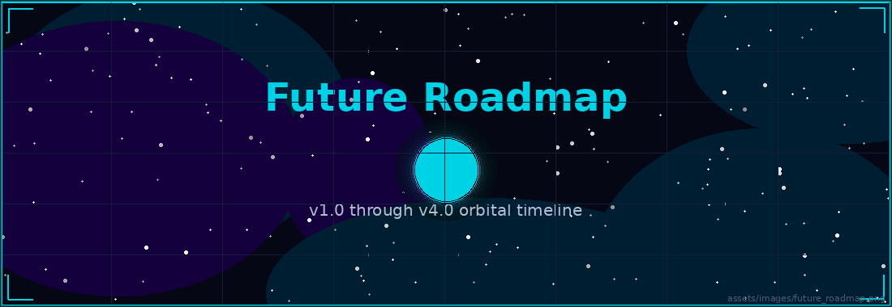
> 🖼️ *Suggested content: A space-themed timeline roadmap. Displayed as a curved orbital path (like a planet's trajectory) with milestone markers along it. Milestones listed: v1.0 — Current Release (bright star), v1.5 — Atmospheric Modelling, v2.0 — Deep Learning Integration, v2.5 — NASA API Live Sync, v3.0 — 3D Galaxy Visualization, v4.0 — Multi-modal AI (image + spectra). Each milestone is a glowing planet-like node. The path extends into a bright horizon labelled "The Future". Dark background, cosmic colours.*

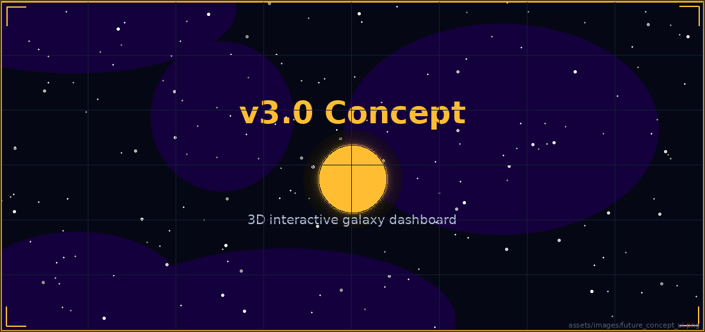
> 🖼️ *Suggested content: A futuristic concept mockup of ExoHabitAI v3.0. Shows a 3D interactive galaxy map where habitable exoplanets glow green and user can click on any star to drill into its planetary system. Dark UI with WebGL-style 3D rendering. Labelled "Concept: ExoHabitAI v3.0 — Interactive Galaxy Dashboard".*

</div>

| Version | Feature | Status |
|---------|---------|--------|
| v1.0 | Core ML + Web Dashboard | ✅ **Released** |
| v1.5 | Deep Learning (Neural Net) model | 🔄 In Progress |
| v2.0 | Atmospheric composition modelling | 📋 Planned |
| v2.5 | Live NASA Exoplanet Archive API sync | 📋 Planned |
| v3.0 | 3D interactive galaxy visualisation (Three.js) | 💡 Concept |
| v3.5 | Multi-star system habitability analysis | 💡 Concept |
| v4.0 | Spectroscopy image input (CNN model) | 💡 Concept |

---

<br/>

## 🤝 Contributing

<div align="center">

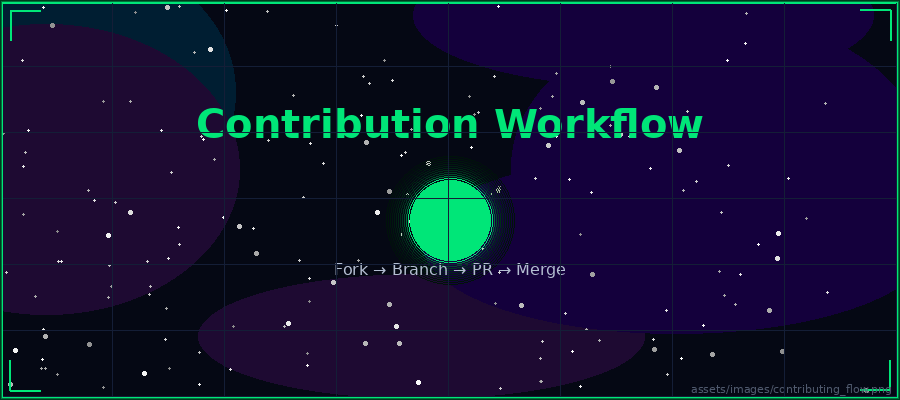
> 🖼️ *Suggested content: A Git workflow diagram styled as a space mission branching diagram. Shows: main branch (stable orbit), dev branch (development orbit), feature branches (short satellite trajectories), a PR/review phase (docking station), and merge back to main (successful docking). Each branch is labelled. Icons: 🚀 for features, 🐛 for bug fixes, 📖 for docs. Title: "ExoHabitAI Contribution Workflow".*

</div>

Contributions from the community are warmly welcomed! Here's how to get involved:

```bash
# 1. Fork the repository on GitHub

# 2. Clone your fork
git clone https://github.com/YOUR_USERNAME/ExoHabitAI.git

# 3. Create a feature branch
git checkout -b feature/your-amazing-feature

# 4. Make your changes and commit
git add .
git commit -m "feat: add atmospheric modelling module"

# 5. Push to your fork
git push origin feature/your-amazing-feature

# 6. Open a Pull Request on GitHub
```

### Contribution Guidelines
- 🐛 **Bug Reports** — Use the [Issues](https://github.com/yourusername/ExoHabitAI/issues) tab with the `bug` label
- 💡 **Feature Requests** — Use Issues with the `enhancement` label
- 📖 **Documentation** — PRs improving docs are always welcome
- 🧪 **Tests** — All new features must include unit tests
- 🎨 **Code Style** — Follow PEP 8 for Python; ESLint config for JavaScript

---

<br/>

## 📜 License

This project is licensed under the **MIT License** — see the [LICENSE](LICENSE) file for full details.

```
MIT License — Copyright (c) 2024 ExoHabitAI Contributors

Permission is hereby granted, free of charge, to any person obtaining a copy
of this software and associated documentation files, to deal in the Software
without restriction, including without limitation the rights to use, copy,
modify, merge, publish, distribute, sublicense, and/or sell copies...
```

---

<br/>

## 👩‍💻 Author

<div align="center">

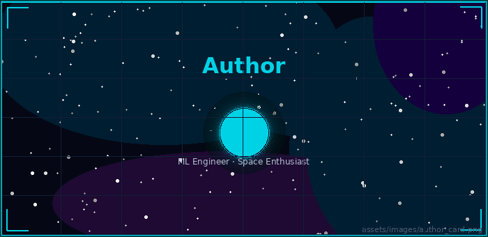
> 🖼️ *Suggested content: A stylised "mission commander" profile card on a dark background. Profile photo in a circular frame with a subtle space-suit collar illustration. Name below in bold. Tagline: "ML Engineer · Space Enthusiast · Open Source Advocate". Social links as icon buttons: GitHub, LinkedIn, Twitter/X, Email. A small badge: "🚀 Builder of ExoHabitAI". Star-field background with subtle nebula.*

**Your Name**
*ML Engineer & Astrophysics Enthusiast*

[](https://github.com/yourusername)
[](https://linkedin.com/in/yourusername)
[](https://twitter.com/yourusername)
[](mailto:your@email.com)

</div>

---

<br/>

<div align="center">

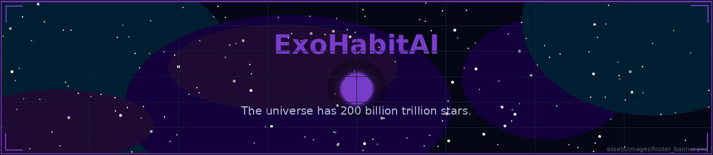
> 🖼️ *Suggested content: A wide cinematic footer banner. Deep black background with a slowly brightening horizon at the bottom — a sunrise over an alien ocean on an exoplanet. Stars reflected in the water. The ExoHabitAI logo centred at the top. Below it, the text: "The universe has 200 billion trillion stars. We're just getting started." Ethereal, inspiring, final.*

---

*Made with ❤️ and a telescope*

*"The cosmos is within us. We are made of star-stuff."* — Carl Sagan


[](https://github.com/yourusername/ExoHabitAI)

</div>

---

<!-- ============================================================
     END OF README
     All image paths reference: assets/images/ and assets/gifs/
     Create this folder in your repository root and add images.
     ============================================================ -->
